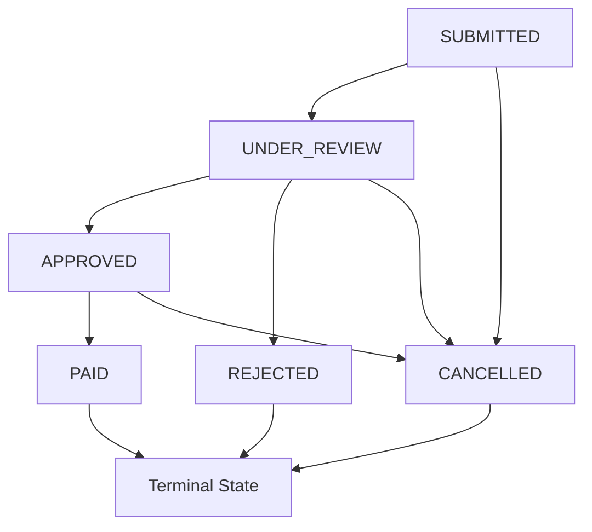

# Claim Management Microservice

A comprehensive insurance claim management system built with Spring Boot 3.2.2, Java 17, and H2 database. This project serves as both a production-ready microservice and a learning hub for modern Java enterprise development.

## 🏗️ Architecture Overview

This microservice follows **Clean Architecture** principles with clear separation of concerns:

```
┌─────────────────────────────────────────────────────────────┐
│                    Presentation Layer                       │
│  ┌─────────────────┐  ┌─────────────────┐  ┌─────────────┐ │
│  │   Controllers   │  │  Exception      │  │   DTOs      │ │
│  │   (REST APIs)   │  │   Handlers      │  │             │ │
│  └─────────────────┘  └─────────────────┘  └─────────────┘ │
└─────────────────────────────────────────────────────────────┘
                                │
┌─────────────────────────────────────────────────────────────┐
│                    Business Layer                           │
│  ┌─────────────────┐  ┌─────────────────┐  ┌─────────────┐ │
│  │    Services     │  │     Mappers     │  │  Validators │ │
│  │ (Business Logic)│  │   (MapStruct)   │  │             │ │
│  └─────────────────┘  └─────────────────┘  └─────────────┘ │
└─────────────────────────────────────────────────────────────┘
                                │
┌─────────────────────────────────────────────────────────────┐
│                    Data Layer                               │
│  ┌─────────────────┐  ┌─────────────────┐  ┌─────────────┐ │
│  │  Repositories   │  │    Entities     │  │  Database   │ │
│  │  (Spring Data)  │  │     (JPA)       │  │     (H2)    │ │
│  └─────────────────┘  └─────────────────┘  └─────────────┘ │
└─────────────────────────────────────────────────────────────┘
```

## 🚀 Quick Start

### Prerequisites
- Java 17 or higher
- Maven 3.6+
- IDE (IntelliJ IDEA, Eclipse, VS Code)

### Running the Application

1. **Clone the repository**
   ```bash
   git clone <repository-url>
   cd claim-management-service
   ```

2. **Build the project**
   ```bash
   mvn clean compile
   ```

3. **Run the application**
   ```bash
   mvn spring-boot:run
   ```

4. **Access the application**
   - API Base URL: `http://localhost:8080/api/v1`
   - Swagger UI: `http://localhost:8080/swagger-ui.html`
   - H2 Console: `http://localhost:8080/h2-console`
     - JDBC URL: `jdbc:h2:mem:claimdb`
     - Username: `sa`
     - Password: `password`

## 📋 Features

### Core Functionality
- ✅ **Claim Management**: Create, read, update, delete claims
- ✅ **Status Workflow**: Manage claim lifecycle with business rules
- ✅ **Search & Filter**: Advanced search capabilities
- ✅ **Pagination**: Efficient data retrieval for large datasets
- ✅ **Validation**: Comprehensive input validation
- ✅ **Exception Handling**: Graceful error handling with meaningful messages

### Technical Features
- ✅ **RESTful APIs**: Following REST principles
- ✅ **OpenAPI Documentation**: Auto-generated API docs
- ✅ **Database Integration**: JPA/Hibernate with H2
- ✅ **Transaction Management**: ACID compliance
- ✅ **Logging**: Structured logging with SLF4J
- ✅ **Testing**: Unit and integration tests
- ✅ **Mapping**: Automatic DTO-Entity mapping with MapStruct

## 🔧 Technology Stack

### Core Technologies
| Technology | Version | Purpose |
|------------|---------|---------|
| **Java** | 17 | Programming language |
| **Spring Boot** | 3.2.2 | Application framework |
| **Spring Data JPA** | 3.2.2 | Data access layer |
| **H2 Database** | 2.2.224 | In-memory database |
| **Maven** | 3.6+ | Build tool |

### Libraries & Tools
| Library | Purpose | Why Used |
|---------|---------|----------|
| **MapStruct** | Object mapping | Type-safe, performant mapping |
| **Hibernate Validator** | Bean validation | Input validation |
| **SpringDoc OpenAPI** | API documentation | Auto-generated docs |
| **SLF4J + Logback** | Logging | Structured logging |
| **JUnit 5** | Testing framework | Modern testing |
| **Mockito** | Mocking framework | Unit test isolation |

## 📊 Database Schema

### Claims Table
```sql
CREATE TABLE claims (
    id BIGINT PRIMARY KEY AUTO_INCREMENT,
    claim_number VARCHAR(50) UNIQUE NOT NULL,
    policy_number VARCHAR(50) NOT NULL,
    claimant_name VARCHAR(100) NOT NULL,
    claimant_email VARCHAR(100) NOT NULL,
    claimant_phone VARCHAR(20),
    description VARCHAR(1000) NOT NULL,
    claim_amount DECIMAL(10,2) NOT NULL,
    status VARCHAR(20) NOT NULL,
    incident_date TIMESTAMP NOT NULL,
    created_at TIMESTAMP NOT NULL,
    updated_at TIMESTAMP NOT NULL
);
```

### Indexes
- `idx_claim_number` on `claim_number`
- `idx_policy_number` on `policy_number`
- `idx_status` on `status`

## 🔄 Claim Status Workflow



### Status Transitions
| From | To | Business Rule |
|------|----|--------------| 
| SUBMITTED | UNDER_REVIEW | Initial review process |
| SUBMITTED | CANCELLED | Early cancellation |
| UNDER_REVIEW | APPROVED | Meets all requirements |
| UNDER_REVIEW | REJECTED | Doesn't meet requirements |
| UNDER_REVIEW | CANCELLED | Process cancellation |
| APPROVED | PAID | Payment processed |
| APPROVED | CANCELLED | Last-minute cancellation |

## 🌐 API Endpoints

### Claim Operations
| Method | Endpoint | Description |
|--------|----------|-------------|
| `POST` | `/api/v1/claims` | Create new claim |
| `GET` | `/api/v1/claims/{id}` | Get claim by ID |
| `GET` | `/api/v1/claims/number/{claimNumber}` | Get claim by number |
| `GET` | `/api/v1/claims` | Get all claims (paginated) |
| `PUT` | `/api/v1/claims/{id}` | Update claim |
| `PATCH` | `/api/v1/claims/{id}/status` | Update claim status |
| `DELETE` | `/api/v1/claims/{id}` | Delete claim |

### Search & Filter Operations
| Method | Endpoint | Description |
|--------|----------|-------------|
| `GET` | `/api/v1/claims/search` | Search claims by criteria |
| `GET` | `/api/v1/claims/policy/{policyNumber}` | Get claims by policy |
| `GET` | `/api/v1/claims/claimant/{email}` | Get claims by claimant |
| `GET` | `/api/v1/claims/high-value` | Get high-value claims |
| `GET` | `/api/v1/claims/date-range` | Get claims by date range |
| `GET` | `/api/v1/claims/search-by-name` | Search by claimant name |
| `GET` | `/api/v1/claims/count` | Get claim count by status |

## 🧪 Testing

### Running Tests
```bash
# Run all tests
mvn test

# Run specific test class
mvn test -Dtest=ClaimServiceTest

# Run with coverage
mvn test jacoco:report
```

### Test Structure
```
src/test/java/
├── controller/          # Integration tests
├── service/            # Unit tests
└── repository/         # Data layer tests
```

## 📈 Monitoring & Health Checks

### Actuator Endpoints
- Health: `GET /actuator/health`
- Info: `GET /actuator/info`
- Metrics: `GET /actuator/metrics`

## 🔒 Security Considerations

### Current Implementation
- Input validation with Bean Validation
- SQL injection prevention with JPA
- Exception handling without sensitive data exposure

### Production Recommendations
- Add Spring Security for authentication/authorization
- Implement rate limiting
- Add HTTPS/TLS configuration
- Implement audit logging
- Add data encryption for sensitive fields

## 🚀 Deployment

### Local Development
```bash
mvn spring-boot:run
```

### Production Build
```bash
mvn clean package
java -jar target/claim-management-service-1.0.0.jar
```

### Docker (Future Enhancement)
```dockerfile
FROM openjdk:17-jre-slim
COPY target/claim-management-service-1.0.0.jar app.jar
EXPOSE 8080
ENTRYPOINT ["java", "-jar", "/app.jar"]
```

## 📚 Learning Resources

### Spring Boot Concepts Demonstrated
1. **Dependency Injection**: Constructor-based injection
2. **Auto-Configuration**: Minimal configuration approach
3. **Data Access**: Spring Data JPA repositories
4. **Web Layer**: RESTful controllers
5. **Validation**: Bean Validation with custom messages
6. **Exception Handling**: Global exception handlers
7. **Testing**: Unit and integration testing strategies

### Design Patterns Used
1. **Repository Pattern**: Data access abstraction
2. **DTO Pattern**: Data transfer objects
3. **Mapper Pattern**: Object transformation
4. **Builder Pattern**: Error response construction
5. **Factory Pattern**: Exception creation
6. **Strategy Pattern**: Status transition validation

### Best Practices Implemented
1. **Clean Code**: Meaningful names, small methods
2. **SOLID Principles**: Single responsibility, dependency inversion
3. **DRY Principle**: Don't repeat yourself
4. **Fail Fast**: Early validation and error detection
5. **Immutability**: Final fields where possible
6. **Documentation**: Comprehensive JavaDoc comments

## 📚 Comprehensive Documentation

This project includes extensive documentation to serve as your learning hub:

### 📖 Core Documentation
- **[Learning Guide](docs/LEARNING_GUIDE.md)**: Comprehensive tutorial covering all technologies and patterns used
- **[High-Level Design (HLD)](docs/HLD.md)**: System architecture and design decisions
- **[Low-Level Design (LLD)](docs/LLD.md)**: Detailed technical specifications and implementation details
- **[API Documentation](docs/API_DOCUMENTATION.md)**: Complete REST API reference with examples

### 🧪 Testing & Quality
- **[Testing Guide](docs/TESTING_GUIDE.md)**: Unit testing, integration testing, and API testing strategies
- **[Postman Collection](postman/)**: Ready-to-use API tests for local development

### 🚀 Operations
- **[Deployment Guide](docs/DEPLOYMENT_GUIDE.md)**: Local, Docker, and cloud deployment instructions

### 🎯 Learning Path

1. **Start Here**: Read the [Learning Guide](docs/LEARNING_GUIDE.md) for comprehensive technology explanations
2. **Understand Architecture**: Review [HLD](docs/HLD.md) and [LLD](docs/LLD.md) for system design
3. **Explore APIs**: Use [API Documentation](docs/API_DOCUMENTATION.md) and Postman collection
4. **Run Tests**: Follow [Testing Guide](docs/TESTING_GUIDE.md) to understand testing strategies
5. **Deploy**: Use [Deployment Guide](docs/DEPLOYMENT_GUIDE.md) for various deployment options

## 🤝 Contributing

### Code Style
- Follow Java naming conventions
- Use meaningful variable and method names
- Add JavaDoc for public methods
- Write unit tests for new features
- Follow existing project structure

### Git Workflow
1. Create feature branch from `main`
2. Make changes with descriptive commits
3. Add/update tests
4. Update documentation
5. Create pull request

## 📄 License

This project is licensed under the MIT License - see the [LICENSE](LICENSE) file for details.

## 📞 Support

For questions or support:
- Create an issue in the repository
- Check the [API documentation](http://localhost:8080/swagger-ui.html)
- Review the test cases for usage examples

---

**Happy Coding! 🎉**

This project demonstrates enterprise-grade Java development with Spring Boot. Use it as a reference for building robust, scalable microservices.