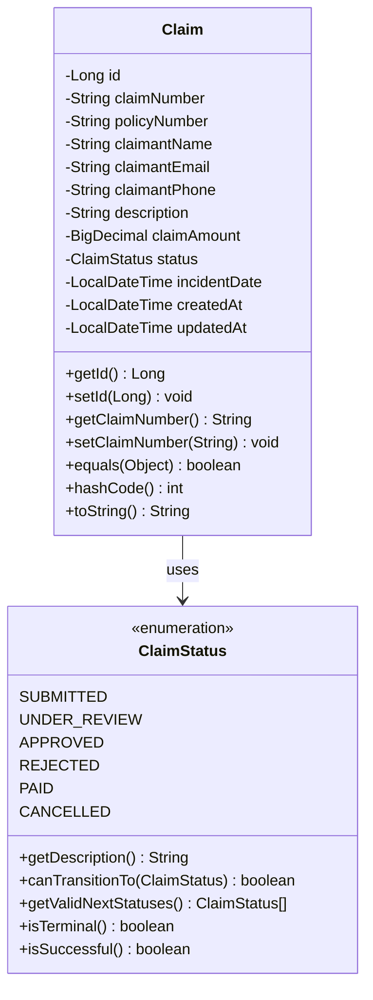
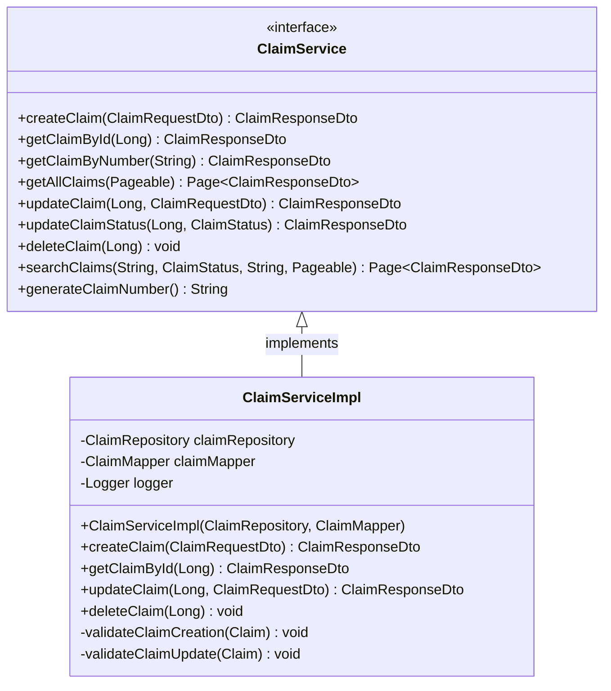
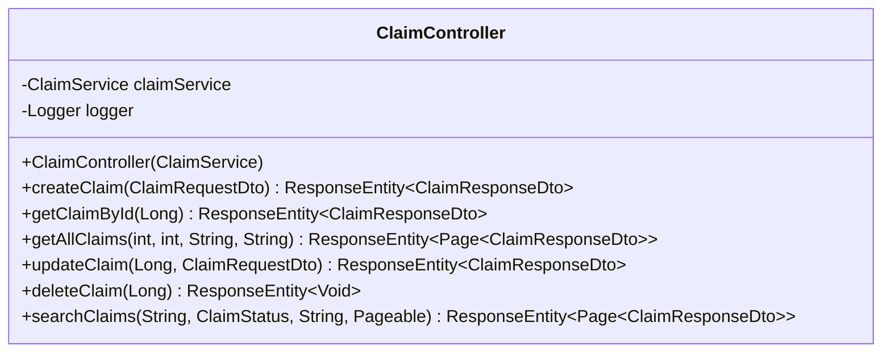

# Low-Level Design (LLD) - Claim Management Microservice

## 1. Introduction

This document provides detailed technical specifications for the Claim Management Microservice implementation, including class designs, method signatures, database schemas, and interaction patterns.

## 2. Package Structure

```
com.claimmanagement/
├── ClaimManagementServiceApplication.java    # Main application class
├── controller/                               # REST controllers
│   └── ClaimController.java
├── service/                                  # Business logic layer
│   ├── ClaimService.java                    # Service interface
│   └── impl/
│       └── ClaimServiceImpl.java            # Service implementation
├── repository/                              # Data access layer
│   └── ClaimRepository.java
├── model/                                   # Domain models
│   ├── entity/
│   │   ├── Claim.java                      # JPA entity
│   │   └── ClaimStatus.java                # Status enum
│   └── dto/
│       ├── ClaimRequestDto.java            # Request DTO
│       └── ClaimResponseDto.java           # Response DTO
├── mapper/                                  # Object mapping
│   └── ClaimMapper.java                    # MapStruct mapper
└── exception/                              # Custom exceptions
    ├── ClaimNotFoundException.java
    ├── InvalidClaimStateException.java
    └── GlobalExceptionHandler.java
```

## 3. Class Diagrams

### 3.1 Entity Layer



### 3.2 Service Layer



### 3.3 Controller Layer



## 4. Database Design

### 4.1 Table Schema

```sql
CREATE TABLE claims (
    id BIGINT PRIMARY KEY AUTO_INCREMENT,
    claim_number VARCHAR(50) UNIQUE NOT NULL,
    policy_number VARCHAR(50) NOT NULL,
    claimant_name VARCHAR(100) NOT NULL,
    claimant_email VARCHAR(100) NOT NULL,
    claimant_phone VARCHAR(20),
    description VARCHAR(1000) NOT NULL,
    claim_amount DECIMAL(10,2) NOT NULL,
    status VARCHAR(20) NOT NULL,
    incident_date TIMESTAMP NOT NULL,
    created_at TIMESTAMP NOT NULL DEFAULT CURRENT_TIMESTAMP,
    updated_at TIMESTAMP NOT NULL DEFAULT CURRENT_TIMESTAMP ON UPDATE CURRENT_TIMESTAMP
);
```

### 4.2 Indexes

```sql
-- Primary key index (automatic)
CREATE INDEX idx_claims_pk ON claims(id);

-- Business key index
CREATE UNIQUE INDEX idx_claim_number ON claims(claim_number);

-- Query optimization indexes
CREATE INDEX idx_policy_number ON claims(policy_number);
CREATE INDEX idx_status ON claims(status);
CREATE INDEX idx_claimant_email ON claims(claimant_email);
CREATE INDEX idx_created_at ON claims(created_at);
CREATE INDEX idx_incident_date ON claims(incident_date);

-- Composite indexes for common queries
CREATE INDEX idx_policy_status ON claims(policy_number, status);
CREATE INDEX idx_status_created ON claims(status, created_at);
```

### 4.3 Database Constraints

```sql
-- Check constraints
ALTER TABLE claims ADD CONSTRAINT chk_claim_amount 
    CHECK (claim_amount > 0);

ALTER TABLE claims ADD CONSTRAINT chk_status 
    CHECK (status IN ('SUBMITTED', 'UNDER_REVIEW', 'APPROVED', 'REJECTED', 'PAID', 'CANCELLED'));

ALTER TABLE claims ADD CONSTRAINT chk_incident_date 
    CHECK (incident_date <= CURRENT_TIMESTAMP);

-- Foreign key constraints (for future enhancements)
-- ALTER TABLE claims ADD CONSTRAINT fk_policy 
--     FOREIGN KEY (policy_number) REFERENCES policies(policy_number);
```

## 5. API Specifications

### 5.1 REST Endpoints

#### 5.1.1 Create Claim
```http
POST /api/v1/claims
Content-Type: application/json

{
    "policyNumber": "POL-2024-001234",
    "claimantName": "John Doe",
    "claimantEmail": "john.doe@email.com",
    "claimantPhone": "+1-555-123-4567",
    "description": "Vehicle collision at intersection",
    "claimAmount": 5000.00,
    "incidentDate": "2024-01-15T14:30:00"
}
```

**Response (201 Created):**
```json
{
    "id": 1,
    "claimNumber": "CLM-2024-000001",
    "policyNumber": "POL-2024-001234",
    "claimantName": "John Doe",
    "claimantEmail": "john.doe@email.com",
    "claimantPhone": "+1-555-123-4567",
    "description": "Vehicle collision at intersection",
    "claimAmount": 5000.00,
    "status": "SUBMITTED",
    "incidentDate": "2024-01-15T14:30:00",
    "createdAt": "2024-01-16T09:00:00",
    "updatedAt": "2024-01-16T09:00:00"
}
```

#### 5.1.2 Get Claim by ID
```http
GET /api/v1/claims/{id}
```

#### 5.1.3 Update Claim Status
```http
PATCH /api/v1/claims/{id}/status?status=UNDER_REVIEW
```

### 5.2 Error Responses

#### 5.2.1 Validation Error (400)
```json
{
    "timestamp": "2024-01-16T10:30:00",
    "status": 400,
    "error": "Validation Failed",
    "message": "Request validation failed",
    "path": "/api/v1/claims",
    "details": {
        "validationErrors": {
            "claimantEmail": "Please provide a valid email address",
            "claimAmount": "Claim amount must be greater than 0"
        }
    }
}
```

#### 5.2.2 Not Found Error (404)
```json
{
    "timestamp": "2024-01-16T10:30:00",
    "status": 404,
    "error": "Claim Not Found",
    "message": "Claim not found with ID: 999",
    "path": "/api/v1/claims/999",
    "details": {
        "claimIdentifier": "999"
    }
}
```

## 6. Method Specifications

### 6.1 ClaimServiceImpl Methods

#### 6.1.1 createClaim Method
```java
@Override
@Transactional
public ClaimResponseDto createClaim(ClaimRequestDto requestDto) {
    // Input validation
    validateClaimCreation(requestDto);
    
    // Convert DTO to entity
    Claim claim = claimMapper.toEntity(requestDto);
    
    // Generate unique claim number
    String claimNumber = generateClaimNumber();
    claim.setClaimNumber(claimNumber);
    
    // Set default status
    if (claim.getStatus() == null) {
        claim.setStatus(ClaimStatus.SUBMITTED);
    }
    
    // Business rule validation
    validateClaimCreation(claim);
    
    // Save to database
    Claim savedClaim = claimRepository.save(claim);
    
    // Convert back to DTO
    return claimMapper.toResponseDto(savedClaim);
}
```

#### 6.1.2 updateClaimStatus Method
```java
@Override
@Transactional
public ClaimResponseDto updateClaimStatus(Long id, ClaimStatus newStatus) {
    // Retrieve existing claim
    Claim claim = claimRepository.findById(id)
        .orElseThrow(() -> ClaimNotFoundException.byId(id));
    
    // Validate status transition
    if (!claim.getStatus().canTransitionTo(newStatus)) {
        throw InvalidClaimStateException.invalidTransition(
            claim.getStatus(), newStatus, claim.getClaimNumber());
    }
    
    // Update status
    claim.setStatus(newStatus);
    
    // Save changes
    Claim updatedClaim = claimRepository.save(claim);
    
    // Return response
    return claimMapper.toResponseDto(updatedClaim);
}
```

### 6.2 ClaimRepository Query Methods

#### 6.2.1 Custom Query Implementation
```java
@Query("SELECT c FROM Claim c WHERE " +
       "(:policyNumber IS NULL OR c.policyNumber = :policyNumber) AND " +
       "(:status IS NULL OR c.status = :status) AND " +
       "(:claimantEmail IS NULL OR c.claimantEmail = :claimantEmail)")
Page<Claim> findByOptionalCriteria(@Param("policyNumber") String policyNumber,
                                  @Param("status") ClaimStatus status,
                                  @Param("claimantEmail") String claimantEmail,
                                  Pageable pageable);
```

## 7. Validation Rules

### 7.1 Bean Validation Annotations

#### 7.1.1 ClaimRequestDto Validations
```java
public class ClaimRequestDto {
    @NotBlank(message = "Policy number is required")
    @Size(min = 5, max = 50, message = "Policy number must be between 5 and 50 characters")
    private String policyNumber;
    
    @NotBlank(message = "Claimant name is required")
    @Size(min = 2, max = 100, message = "Claimant name must be between 2 and 100 characters")
    private String claimantName;
    
    @NotBlank(message = "Claimant email is required")
    @Email(message = "Please provide a valid email address")
    @Size(max = 100, message = "Email must not exceed 100 characters")
    private String claimantEmail;
    
    @Pattern(regexp = "^[+]?[0-9\\s\\-\\(\\)]{10,20}$", 
             message = "Please provide a valid phone number")
    private String claimantPhone;
    
    @NotNull(message = "Claim amount is required")
    @DecimalMin(value = "0.01", message = "Claim amount must be greater than 0")
    @DecimalMax(value = "1000000.00", message = "Claim amount cannot exceed $1,000,000")
    @Digits(integer = 8, fraction = 2, message = "Claim amount format is invalid")
    private BigDecimal claimAmount;
    
    @NotNull(message = "Incident date is required")
    @PastOrPresent(message = "Incident date cannot be in the future")
    private LocalDateTime incidentDate;
}
```

### 7.2 Business Rule Validations

#### 7.2.1 Claim Creation Validation
```java
private void validateClaimCreation(Claim claim) {
    // Business Rule: Claim amount must be positive
    if (claim.getClaimAmount().compareTo(BigDecimal.ZERO) <= 0) {
        throw new IllegalArgumentException("Claim amount must be greater than zero");
    }
    
    // Business Rule: Incident date cannot be in the future
    if (claim.getIncidentDate().isAfter(LocalDateTime.now())) {
        throw new IllegalArgumentException("Incident date cannot be in the future");
    }
    
    // Business Rule: Incident date cannot be more than 2 years old
    LocalDateTime twoYearsAgo = LocalDateTime.now().minusYears(2);
    if (claim.getIncidentDate().isBefore(twoYearsAgo)) {
        throw new IllegalArgumentException("Incident date cannot be more than 2 years old");
    }
}
```

## 8. State Machine Implementation

### 8.1 ClaimStatus Enum State Logic
```java
public enum ClaimStatus {
    SUBMITTED("Claim has been submitted and is awaiting initial review"),
    UNDER_REVIEW("Claim is under review by claims department"),
    APPROVED("Claim has been approved for payment"),
    REJECTED("Claim has been rejected"),
    PAID("Claim has been paid"),
    CANCELLED("Claim has been cancelled");
    
    public boolean canTransitionTo(ClaimStatus newStatus) {
        return switch (this) {
            case SUBMITTED -> newStatus == UNDER_REVIEW || newStatus == CANCELLED;
            case UNDER_REVIEW -> newStatus == APPROVED || newStatus == REJECTED || newStatus == CANCELLED;
            case APPROVED -> newStatus == PAID || newStatus == CANCELLED;
            case REJECTED, PAID, CANCELLED -> false; // Terminal states
        };
    }
}
```

### 8.2 State Transition Matrix
| Current State | Valid Next States | Business Logic |
|---------------|-------------------|----------------|
| SUBMITTED | UNDER_REVIEW, CANCELLED | Initial processing or early cancellation |
| UNDER_REVIEW | APPROVED, REJECTED, CANCELLED | Review outcome or process cancellation |
| APPROVED | PAID, CANCELLED | Payment processing or last-minute cancellation |
| REJECTED | None | Terminal state - claim denied |
| PAID | None | Terminal state - claim completed successfully |
| CANCELLED | None | Terminal state - claim cancelled |

## 9. Exception Handling Strategy

### 9.1 Exception Hierarchy
```java
RuntimeException
├── ClaimNotFoundException
│   ├── byId(Long id)
│   ├── byClaimNumber(String claimNumber)
│   └── byPolicyNumber(String policyNumber)
├── InvalidClaimStateException
│   ├── invalidTransition(ClaimStatus current, ClaimStatus attempted, String claimId)
│   ├── terminalStateModification(ClaimStatus current, String claimId)
│   └── operationNotAllowed(String operation, ClaimStatus current, String claimId)
└── IllegalArgumentException (for validation errors)
```

### 9.2 Global Exception Handler Mapping
```java
@ExceptionHandler(ClaimNotFoundException.class)
public ResponseEntity<ErrorResponse> handleClaimNotFoundException(
        ClaimNotFoundException ex, WebRequest request) {
    return new ResponseEntity<>(
        createErrorResponse(HttpStatus.NOT_FOUND, ex.getMessage(), request),
        HttpStatus.NOT_FOUND
    );
}

@ExceptionHandler(InvalidClaimStateException.class)
public ResponseEntity<ErrorResponse> handleInvalidClaimStateException(
        InvalidClaimStateException ex, WebRequest request) {
    return new ResponseEntity<>(
        createErrorResponse(HttpStatus.BAD_REQUEST, ex.getMessage(), request),
        HttpStatus.BAD_REQUEST
    );
}
```

## 10. Mapping Strategy

### 10.1 MapStruct Configuration
```java
@Mapper(
    componentModel = "spring",
    unmappedTargetPolicy = ReportingPolicy.IGNORE,
    nullValuePropertyMappingStrategy = NullValuePropertyMappingStrategy.IGNORE
)
public interface ClaimMapper {
    
    @Mapping(target = "id", ignore = true)
    @Mapping(target = "claimNumber", ignore = true)
    @Mapping(target = "createdAt", ignore = true)
    @Mapping(target = "updatedAt", ignore = true)
    Claim toEntity(ClaimRequestDto requestDto);
    
    ClaimResponseDto toResponseDto(Claim claim);
    
    List<ClaimResponseDto> toResponseDtoList(List<Claim> claims);
    
    @Mapping(target = "id", ignore = true)
    @Mapping(target = "claimNumber", ignore = true)
    @Mapping(target = "createdAt", ignore = true)
    @Mapping(target = "updatedAt", ignore = true)
    void updateEntityFromDto(ClaimRequestDto requestDto, @MappingTarget Claim claim);
}
```

## 11. Transaction Management

### 11.1 Service Layer Transactions
```java
@Service
@Transactional  // Default transaction settings for all methods
public class ClaimServiceImpl implements ClaimService {
    
    @Override
    @Transactional  // Read-write transaction
    public ClaimResponseDto createClaim(ClaimRequestDto requestDto) {
        // Implementation with automatic rollback on RuntimeException
    }
    
    @Override
    @Transactional(readOnly = true)  // Read-only optimization
    public ClaimResponseDto getClaimById(Long id) {
        // Read-only operation - no dirty checking
    }
    
    @Override
    @Transactional(
        isolation = Isolation.READ_COMMITTED,
        propagation = Propagation.REQUIRED,
        rollbackFor = Exception.class
    )
    public ClaimResponseDto updateClaimStatus(Long id, ClaimStatus newStatus) {
        // Custom transaction configuration
    }
}
```

## 12. Logging Strategy

### 12.1 Logging Levels and Usage
```java
public class ClaimServiceImpl {
    private static final Logger logger = LoggerFactory.getLogger(ClaimServiceImpl.class);
    
    public ClaimResponseDto createClaim(ClaimRequestDto requestDto) {
        logger.info("Creating new claim for policy: {}", requestDto.getPolicyNumber());
        
        try {
            // Business logic
            logger.debug("Generated claim number: {}", claimNumber);
            logger.info("Successfully created claim: {}", savedClaim.getClaimNumber());
            
        } catch (Exception e) {
            logger.error("Error creating claim for policy: {}", requestDto.getPolicyNumber(), e);
            throw new RuntimeException("Failed to create claim: " + e.getMessage(), e);
        }
    }
}
```

### 12.2 Log Format Configuration
```yaml
logging:
  level:
    com.claimmanagement: DEBUG
    org.springframework.web: DEBUG
    org.hibernate.SQL: DEBUG
  pattern:
    console: "%d{yyyy-MM-dd HH:mm:ss} [%thread] %-5level %logger{36} - %msg%n"
    file: "%d{yyyy-MM-dd HH:mm:ss} [%thread] %-5level %logger{36} - %msg%n"
```

## 13. Performance Considerations

### 13.1 Database Query Optimization
- Use appropriate indexes on frequently queried columns
- Implement pagination for large result sets
- Use `@Query` with JPQL for complex queries
- Avoid N+1 query problems with proper fetch strategies

### 13.2 Memory Management
- Use `@Transactional(readOnly = true)` for read operations
- Implement proper pagination to avoid loading large datasets
- Use streaming for large data processing

### 13.3 Caching Strategy (Future Enhancement)
```java
@Service
public class ClaimServiceImpl {
    
    @Cacheable(value = "claims", key = "#id")
    public ClaimResponseDto getClaimById(Long id) {
        // Cached method implementation
    }
    
    @CacheEvict(value = "claims", key = "#id")
    public ClaimResponseDto updateClaim(Long id, ClaimRequestDto requestDto) {
        // Cache invalidation on update
    }
}
```

## 14. Testing Strategy

### 14.1 Unit Test Structure
```java
@ExtendWith(MockitoExtension.class)
class ClaimServiceImplTest {
    
    @Mock
    private ClaimRepository claimRepository;
    
    @Mock
    private ClaimMapper claimMapper;
    
    @InjectMocks
    private ClaimServiceImpl claimService;
    
    @Test
    void createClaim_ValidRequest_ReturnsClaimResponse() {
        // Given
        ClaimRequestDto requestDto = createValidClaimRequest();
        Claim claim = createClaimEntity();
        Claim savedClaim = createSavedClaimEntity();
        ClaimResponseDto expectedResponse = createClaimResponse();
        
        when(claimMapper.toEntity(requestDto)).thenReturn(claim);
        when(claimRepository.save(any(Claim.class))).thenReturn(savedClaim);
        when(claimMapper.toResponseDto(savedClaim)).thenReturn(expectedResponse);
        
        // When
        ClaimResponseDto result = claimService.createClaim(requestDto);
        
        // Then
        assertThat(result).isEqualTo(expectedResponse);
        verify(claimRepository).save(any(Claim.class));
    }
}
```

### 14.2 Integration Test Structure
```java
@SpringBootTest
@AutoConfigureTestDatabase(replace = AutoConfigureTestDatabase.Replace.NONE)
@TestPropertySource(locations = "classpath:application-test.properties")
class ClaimControllerIntegrationTest {
    
    @Autowired
    private TestRestTemplate restTemplate;
    
    @Autowired
    private ClaimRepository claimRepository;
    
    @Test
    void createClaim_ValidRequest_ReturnsCreatedClaim() {
        // Given
        ClaimRequestDto requestDto = createValidClaimRequest();
        
        // When
        ResponseEntity<ClaimResponseDto> response = restTemplate.postForEntity(
            "/api/v1/claims", requestDto, ClaimResponseDto.class);
        
        // Then
        assertThat(response.getStatusCode()).isEqualTo(HttpStatus.CREATED);
        assertThat(response.getBody().getClaimNumber()).isNotNull();
    }
}
```

This Low-Level Design document provides comprehensive technical specifications for implementing and maintaining the Claim Management Microservice. It serves as a reference for developers working on the system and ensures consistent implementation across the codebase.